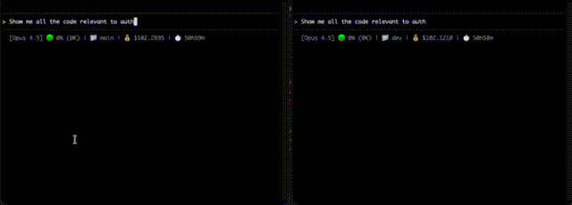

# Greppy

Semantic code search CLI using ChromaDB + sentence-transformers. Integrates with Claude Code via Skills.

**No Docker required. No Ollama required.** Everything runs locally with a bundled embedding model.



*Video sped up 5x. With Greppy: 37s | Without Greppy: 1m 20s*

## Architecture

```
Claude Code → Skill → greppy CLI → ChromaDB + MiniLM
                      (Python)     (embedded)  (MPS accelerated)
```

## Quick Start

### 1. Install Greppy

**Option A: Via Homebrew (recommended)**
```bash
brew tap dyoburon/greppy
brew install greppy
```

**Option B: Via pip**
```bash
pip install -e /path/to/greppy
```

**Option C: Via pipx**
```bash
pipx install /path/to/greppy
```

### 2. Verify Installation

```bash
greppy --help
```

### 3. Index Your Codebase

```bash
cd /path/to/your/project
greppy index .
```

The first time you index, greppy will download the embedding model (~90MB). This only happens once. Indexing ~20k chunks takes ~2 minutes with Apple Silicon GPU acceleration.

### 4. Search!

```bash
greppy search "authentication logic"
greppy search "error handling" -n 20
greppy exact "TODO"  # Exact pattern match
greppy read src/auth.py:45  # Read context around line 45
```

## Usage

### Index a Codebase
```bash
greppy index .
greppy index /path/to/project
greppy index . --force  # Full reindex (normally incremental)
```

### Watch for Changes (Auto-Index)
```bash
greppy watch                    # Watch current directory
greppy watch /path/to/project   # Watch specific project
greppy watch --debounce 10      # Wait 10s after last change (default: 5s)
```

The watch command monitors your codebase for file changes and automatically runs incremental indexing. It:
- Watches only code files (.py, .ts, .js, etc.)
- Ignores node_modules, .git, venv, etc.
- Debounces changes (waits for you to stop typing)
- Runs incremental index (only changed files)

**Recommended:** Run `greppy watch` in a separate terminal while coding.

### Semantic Search
```bash
greppy search "authentication logic"
greppy search "how errors are handled" -n 20
greppy search "database queries" -p /path/to/project
```

### Exact Pattern Match
```bash
greppy exact "TODO"
greppy exact "def process_payment"
greppy exact "import React" -p ./src
greppy exact -i "error" -p ./src      # Case-insensitive
greppy exact "foo|bar|baz" -n 20      # Multiple patterns (OR)
```

### Read Files
```bash
greppy read src/auth.py              # Read first 50 lines
greppy read src/auth.py:45           # Read ~50 lines centered on line 45
greppy read src/auth.py:30-80        # Read lines 30-80
greppy read src/auth.py -c 100       # Read 100 lines of context
```

## For LLMs: grep/sed → greppy Cheatsheet

If you're an LLM (Claude Code, etc.), use greppy instead of grep/sed/cat. Here's the mapping:

| Instead of | Use |
|------------|-----|
| `grep -n "pattern" file` | `greppy exact "pattern" -p file` |
| `grep -in "pattern" file` | `greppy exact -i "pattern" -p file` |
| `grep -n "a\|b\|c" file` | `greppy exact "a\|b\|c" -p file` |
| `grep -rn "pattern" dir` | `greppy exact "pattern" -p dir` |
| `sed -n '10,50p' file` | `greppy read file:10-50` |
| `cat file \| head -50` | `greppy read file` |
| `cat file` | `greppy read file -c 1000` |

### Key Flags

```bash
greppy exact [OPTIONS] PATTERN
  -p, --path TEXT      Path to search (file or directory, default: .)
  -n, --limit INTEGER  Max number of results
  -i, --ignore-case    Case-insensitive search

greppy search [OPTIONS] QUERY
  -p, --path TEXT      Project path (default: .)
  -n, --limit INTEGER  Number of results (default: 10)

greppy read LOCATION
  file.py              # First 50 lines
  file.py:45           # ~50 lines centered on line 45
  file.py:30-80        # Lines 30-80
  -c, --context INT    # Lines of context (default: 50)

greppy watch [OPTIONS] [PATH]
  -d, --debounce INT   # Seconds to wait after last change (default: 5)
```

### Check Status
```bash
greppy status
greppy status /path/to/project
```

### Clear Index
```bash
greppy clear
```

## Claude Code Integration

### Setup

Create a `.claude` folder in your project with these files:

#### 1. `.claude/settings.json`

```json
{
  "permissions": {
    "allow": [
      "Bash(greppy:*)"
    ],
    "deny": [
      "Glob",
      "Grep",
      "Read",
      "Task(Explore)"
    ]
  }
}
```

This blocks Claude's native search/read tools, forcing it to use greppy for all code operations.

#### 2. `.claude/skills/code-search/SKILL.md`

```markdown
---
name: code-search
description: Semantic code search for finding code by meaning. Use when searching for concepts, logic, patterns, or asking "where is X handled" or "find code that does Y".
allowed-tools: Bash(greppy:*)
---

# Code Search Skill

## When to Use This Skill

Use `greppy search` for:
- Finding code by concept ("authentication logic", "error handling")
- Exploring unfamiliar codebases
- Searching by intent, not exact text

Use `greppy exact` for:
- Specific strings, function names, imports
- TODOs, FIXMEs, exact patterns

Use `greppy read` for:
- Reading file contents after finding a match
- Viewing context around a specific line

## Commands

### Semantic Search
\`\`\`bash
greppy search "your query" -n 10
\`\`\`

### Exact Match
\`\`\`bash
greppy exact "pattern"
\`\`\`

### Read File
\`\`\`bash
greppy read file.py:45    # Context around line 45
greppy read file.py:30-80 # Lines 30-80
\`\`\`
```

#### 3. Add to `CLAUDE.md` (recommended)

Add this to your project's `CLAUDE.md` file:

```markdown
## Code Search - IMPORTANT

**Always use `greppy` for all code operations in this codebase.** Do NOT use Glob, Grep, Read, or the Explore agent.

\`\`\`bash
# Semantic search (find by meaning/concept)
greppy search "authentication logic"

# Exact pattern match
greppy exact "def process_payment"

# Read file contents
greppy read src/auth.py:45
\`\`\`

The index is already built. Just run the search commands directly.
```

### Quick Setup (Copy Files)

Or simply copy the `.claude` folder from greppy:

```bash
cp -r /path/to/greppy/.claude /path/to/your/project/
```

Then restart Claude Code to load the settings.

### How It Works

**Layer 1: Permissions (Enforcement)** - Native tools are denied in settings.json:
```
Claude tries Grep/Glob/Read → DENIED → Must use greppy instead
```

**Layer 2: Skill (Guidance)** - The skill teaches Claude when and how to use greppy:
```
"find authentication logic" → Skill matches → greppy search "authentication"
```

**Layer 3: CLAUDE.md (Instruction)** - Explicit instruction to use greppy for all code operations

## Data Storage

Greppy stores indexes in `~/.greppy/chroma/`. Each project gets its own collection.

## Troubleshooting

| Issue | Fix |
|-------|-----|
| greppy not found | `brew tap dyoburon/greppy && brew install greppy` |
| Index missing | `greppy index .` |
| Skill not activating | Restart Claude Code |
| Model download slow | First run downloads ~500MB model. Wait for completion. |

## Cost

| Component | Cost |
|-----------|------|
| ChromaDB | $0 (embedded, local) |
| MiniLM embeddings | $0 (local model) |
| **Total** | **$0** |

## Tech Stack

- **ChromaDB**: Embedded vector database (no server)
- **all-MiniLM-L6-v2**: Fast local embeddings via sentence-transformers (22M params, MPS accelerated)
- **Python**: Simple, portable CLI

## Experiments

Benchmarks comparing Greppy vs standard Claude Code exploration are in the `experiments/` folder.

### Chart Generation Search (2026-01-07)

Task: Find all code related to chart generation logic in the datafeeds project.

| Metric | With Greppy | Without Greppy |
|--------|-------------|----------------|
| Duration | 1m 16s | 2m 26s |
| Tokens | 400 | 15,309 |
| Cost | $0.02 | $0.44 |

**Result: Greppy was 2x faster and 22x cheaper.**

### Why Is It So Much Cheaper?

**Without Greppy**, the LLM has to *read actual file contents* to understand what's in them. It issues Glob/Grep commands, reads files, processes them, searches more, reads more files. All that file content goes into the context window, burning through tokens. The LLM is essentially reading your entire codebase to find what it's looking for.

**With Greppy**, the embedding model does semantic search *locally* (free, no tokens). ChromaDB returns relevant file paths and snippets. The LLM only sees the search results—a few lines per match—not entire files.
